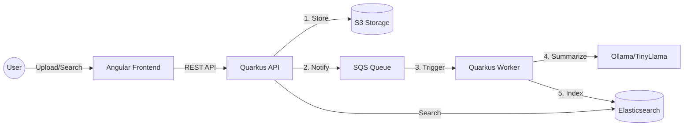
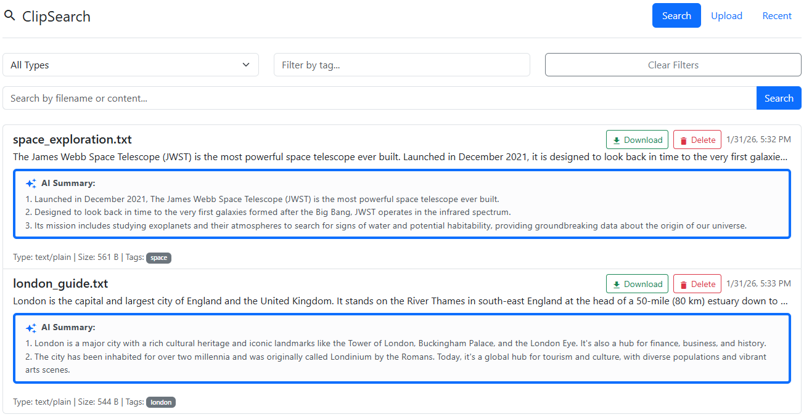

# ClipSearch

ClipSearch is a production-ready, asynchronous document search engine designed for high-performance indexing and AI-powered summarization of PDF and TXT files. Built with a cloud-native architecture, it leverages a distributed pipeline to process documents and provide instant, searchable insights.

## Key Features

- **Asynchronous Processing:** S3-triggered events handled via SQS and dedicated workers.
- **AI Summarization:** Automated generation of 2-3 bullet point summaries using local LLMs (TinyLlama/Ollama).
- **Full-Text Search:** High-performance indexing and retrieval powered by Elasticsearch.
- **Enterprise-Ready:** Fully containerized and optimized for OpenShift/Kubernetes deployment.
- **Clean UI:** Modern Angular-based frontend for seamless file uploads and search.

## How It Works

1. **Ingestion:** Users upload PDF/TXT files via the API, which stores them in S3.
2. **Messaging:** An event is pushed to an SQS queue to trigger background processing.
3. **Extraction:** Workers pull the event, extract text using Apache Tika, and request a summary from the AI engine.
4. **Indexing:** The metadata, extracted text, and AI summary are indexed into Elasticsearch for real-time searching.

## Architecture



## Tech Stack

- **Backend:** Java 17, Quarkus, LangChain4j, Apache Tika.
- **Frontend:** Angular 19, Tailwind CSS.
- **Infrastructure:** Elasticsearch, LocalStack (S3/SQS).
- **AI Engine:** Ollama / Red Hat OpenShift AI.
- **Deployment:** Docker Compose, OpenShift (Kustomize).

## How to Run

### Local Development

1. **Prerequisites:** Docker and Docker Compose installed.
2. **Start Services:**
   ```bash
   docker-compose up -d
   ```
3. **Access UI:** Open `http://localhost:4200` in your browser.

### Build from Source

```bash
# Backend
mvn -f backend/pom.xml clean package -pl api,worker -am

# Frontend
cd frontend && npm install && npm run build
```

## Use Cases

- **Knowledge Management:** Quick indexing of internal documentation and research papers.
- **Automated Summarization:** Fast-tracking document review with AI-generated snippets.
- **Searchable Archives:** Converting large volumes of static files into a searchable database.

## 🚀 CI/CD Pipeline

The project uses GitHub Actions (`.github/workflows/ci.yml`) to:
1.  Build Java components with Maven.
2.  Build Docker images for API, Worker, and Frontend.
3.  Push images to `ghcr.io/dawidbera/clipsearch-*`.

## 🛠 Troubleshooting

### Common Issues
*   **405 on Uploads:** Consistently use `UploadResource` for all upload-related logic.
*   **Single Search Result:** Ensure `uploadId` is used as the Elasticsearch `_id` to avoid duplicates or overwrites.
*   **S3 Connectivity:** Use `path-style access` and ensure endpoints are correctly resolved (internal vs external).
*   **Ollama Connection:** Ensure Ollama is running and accessible (check `llm-standalone` logs on OpenShift).

## Demo

